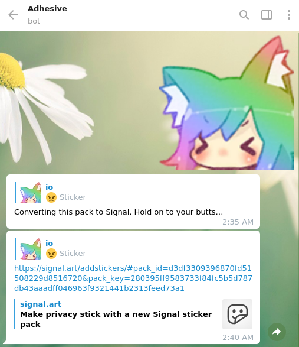

# Adhesive

Adhesive is a simple bot which converts between Signal and Telegram sticker packs.



A running Telegram instance is available: [@AdhesiveStickerBot](https://t.me/AdhesiveStickerBot).
There's also a Signal bot but I'm running low on SIM cards so I don't have a dedicated phone number for it yet.

## Installation

```py
python3 -m venv .venv
. .venv/bin/activate
pip install -Ur requirements.txt --use-feature=2020-resolver
```

Then copy `config.example.toml` to `config.toml` and fill it out according to the comments.
For your Signal username/password you will need to install [Signal Desktop](https://signal.org/download/) and link it to your phone.
Then run `python -m adhesive.signal_auth` to get your credentials.

To run the bot, run `python -m adhesive.bot`.

## Signal bot setup

Setting up a Signal bot is more involved but still doable.
Follow steps 1–6 of the [Quick Start guide](https://github.com/lwesterhof/semaphore/blob/v0.8.0/README.md#quick-start) for the library I use.
Then enter the phone number you used for setup in the `config.toml` file.

## License

© io mintz <io@mintz.cc>

This program is free software: you can redistribute it and/or modify
it under the terms of the GNU Affero General Public License as
published by the Free Software Foundation, either version 3 of the
License, or (at your option) any later version.

This program is distributed in the hope that it will be useful,
but WITHOUT ANY WARRANTY; without even the implied warranty of
MERCHANTABILITY or FITNESS FOR A PARTICULAR PURPOSE. See the
GNU Affero General Public License for more details.

You should have received a copy of the GNU Affero General Public License
along with this program. If not, see <https://www.gnu.org/licenses/>.
