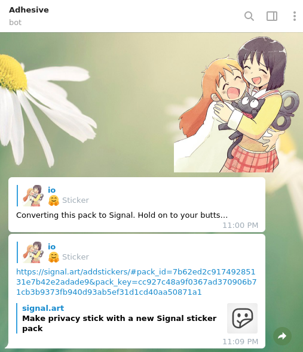
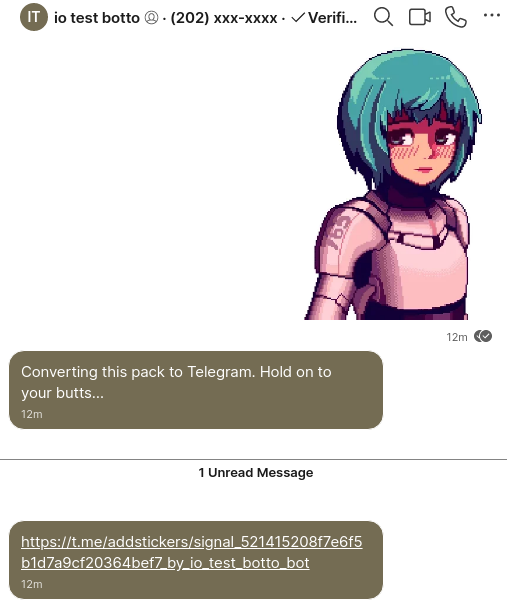

# Adhesive

The Signal bot is down currently, until I learn how to use Signal-CLI. However, bidirectional sticker pack conversion seems to work via [the Telegram bot](https://t.me/AdhesiveStickerBot).

Adhesive is a simple bot which converts between Signal and Telegram sticker packs.




## Installation

```py
python3 -m venv .venv
. .venv/bin/activate
pip install -Ur requirements.txt
```

Then copy `config.example.toml` to `config.toml` and fill it out according to the comments.
For your Signal username/password you will need to install [Signal Desktop](https://signal.org/download/) and link it to your phone.

### Getting the API keys

Install Node.JS and npm, then from within the signal-db-key-pull directory, run `npm install` followed by `npm run start`.
Then run the command it tells you to run to get your credentials.

### Running the bot

To run the bot, run `python -m adhesive.bot`.

## Signal bot setup

TODO

## License

© io

This program is free software: you can redistribute it and/or modify
it under the terms of the GNU Affero General Public License as
published by the Free Software Foundation, either version 3 of the
License, or (at your option) any later version.

This program is distributed in the hope that it will be useful,
but WITHOUT ANY WARRANTY; without even the implied warranty of
MERCHANTABILITY or FITNESS FOR A PARTICULAR PURPOSE. See the
GNU Affero General Public License for more details.

You should have received a copy of the GNU Affero General Public License
along with this program. If not, see <https://www.gnu.org/licenses/>.
